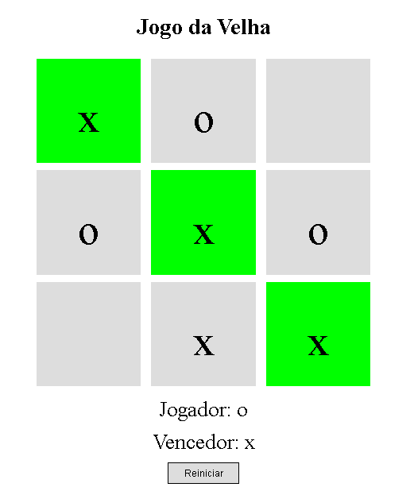
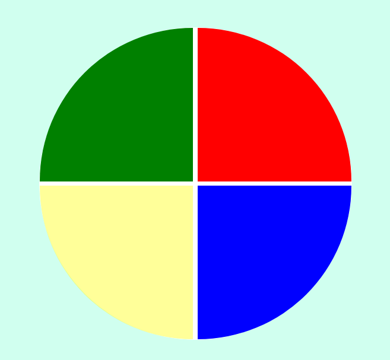
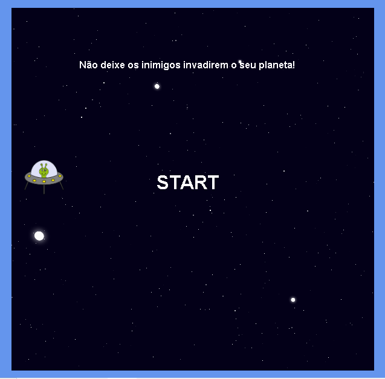

# Games

Este é um repositorio que possue jogos desenvolvidos na intenção de estudar e praticar uma abordagem de desenvolvimento Front-End Web.

## Jogos:
- dinosaur-game
- hast-game
- memory-game
- ship-game
- spaceShooter-game

## Tecnologias:
- JavaScript
- HTML
- CSS

## Como rodar o projeto:
* 1 - Acesse a pasta do jogo;
* 2 - Abra o arquivo index.html.

## Imagens:
      
